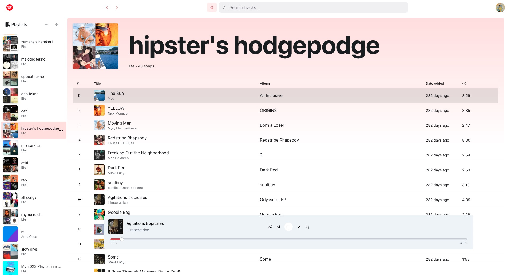

# Spotify React Application

This is a full-stack web application that integrates with the Spotify API, allowing users to interact with their Spotify account, browse music, and control playback

[Watch demo](https://www.youtube.com/watch?v=KOv4k4s6tEg&ab_channel=EfeKonyal%C4%B1)

## 🚀 Features

### Frontend Features
- User authentication with Spotify
- Browse and search music
- View albums, artists, and shows
- Playback control
- Responsive design
- State management with React hooks
- Modern UI components


*Main application interface showing the home page with navigation and content*


*Detailed view of a playlist page showing tracks and information*

### Backend Features
- OAuth 2.0 authentication flow with Spotify
- Token management (access and refresh tokens)
- Secure environment variable handling
- CORS configuration for frontend communication
- Express.js REST API endpoints

## 🛠 Tech Stack

### Frontend
- React.js
- React Router for navigation
- Custom hooks for state management
- Modern JavaScript (ES6+)
- CSS for styling

### Backend
- Node.js
- Express.js
- Axios for HTTP requests
- Cookie-parser for session management
- Environment variable management with dotenv

## 📦 Installation

### Prerequisites
- Node.js (v14 or higher)
- npm or yarn
- Spotify Developer Account

### Backend Setup
1. Navigate to the backend directory:
   ```bash
   cd backend
   ```

2. Install dependencies:
   ```bash
   npm install
   ```

3. Create a `.env` file based on `.env.example`:
   ```
   VITE_APP_CLIENT_ID=your_spotify_client_id
   VITE_APP_CLIENT_SECRET=your_spotify_client_secret
   VITE_APP_REDIRECT_URI=your_redirect_uri
   VITE_APP_FRONTEND_URI=your_frontend_uri
   ```

4. Start the backend server:
   ```bash
   npm start
   ```

### Frontend Setup
1. Navigate to the frontend directory:
   ```bash
   cd frontend
   ```

2. Install dependencies:
   ```bash
   npm install
   ```

3. Start the development server:
   ```bash
   npm run dev
   ```

## 🚀 Deployment

### Backend Deployment
1. Ensure all environment variables are properly set in your deployment platform
2. The backend is ready for deployment on platforms like Heroku or similar services
3. Make sure to set the following environment variables:
   - `VITE_APP_CLIENT_ID`
   - `VITE_APP_CLIENT_SECRET`
   - `VITE_APP_REDIRECT_URI`
   - `VITE_APP_FRONTEND_URI`
   - `PORT` (optional, defaults to 8888)

### Frontend Deployment
1. Build the frontend application:
   ```bash
   cd frontend
   npm run build
   ```
2. Deploy the contents of the `dist` directory to your hosting service
3. Ensure the backend URL is correctly configured in the frontend environment

## 📁 Project Structure

### Frontend Structure
```
frontend/
├── src/
│   ├── components/    # Reusable UI components
│   ├── pages/         # Page components
│   ├── hooks/         # Custom React hooks
│   ├── store/         # State management
│   ├── utils/         # Utility functions
│   ├── assets/        # Static assets
│   └── App.jsx        # Main application component
```

### Backend Structure
```
backend/
├── server.js          # Main server file
├── .env              # Environment variables
└── package.json      # Dependencies and scripts
```

## 🔐 Authentication

The application uses Spotify's OAuth 2.0 authentication flow:
1. User initiates login
2. Backend redirects to Spotify authorization
3. User approves permissions
4. Spotify redirects back with authorization code
5. Backend exchanges code for access and refresh tokens
6. Frontend stores tokens and uses them for API requests

## 🤝 Contributing

1. Fork the repository
2. Create a new branch
3. Make your changes
4. Submit a pull request

## 📄 License

This project is licensed under the MIT License.
